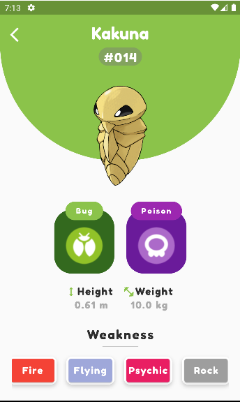
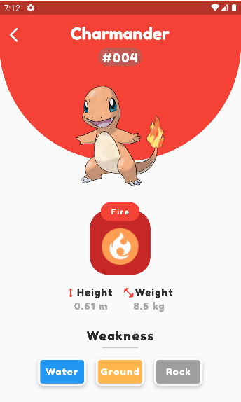
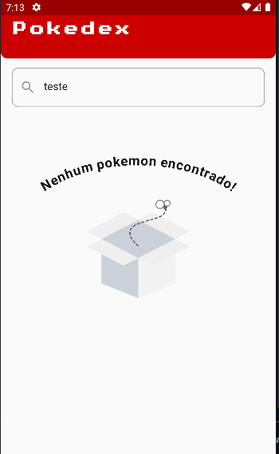
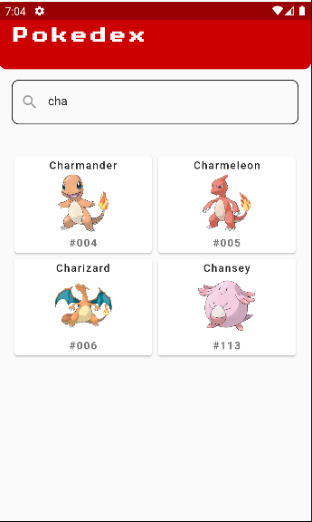
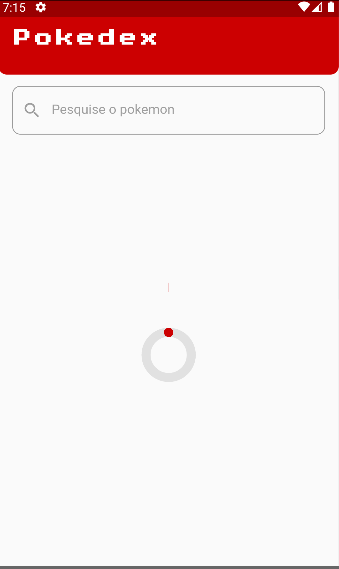
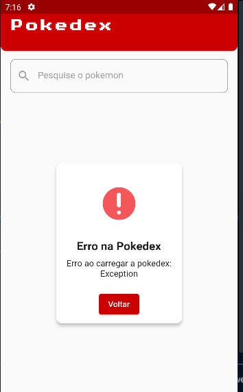

## 💻 Sobre o projeto 💻

O objetivo do projeto era aplicar todos adquirido no serviço e no dia dia através da utilização do **bloc** e do **clean arquiteture** com **modular**, além de consumir api utilizando o **http**, e fazer testes de acordo com o que era recebido.

#### Utilizando a api [PokemonGO-Pokedex](https://raw.githubusercontent.com/Biuni/PokemonGO-Pokedex/master/pokedex.json) como api principal do projeto, foi desenvolvido um aplicativo que lista todos os pokemons e suas informações. Além disso, é possível pesquisar por um pokemon específico e ver suas informações detalhadas como peso e altura, fraquezas, tipos e etc, no projeto foram feito estados de Loading, Error e Sucess utilizando o bloc, na parte visual foram utilizado algumas animações com o Lottie.

## 🛠 Tecnologias 🛠

Ferramentas utilizada no desenvolvimento do projeto:

- [Flutter](https://flutter.dev/)

## Packages utilizados

- [http](https://pub.dev/packages/http)
- [flutter_bloc](https://pub.dev/packages/flutter_bloc)
- [modular](https://pub.dev/packages/http)
- [loading_animation_widget](https://pub.dev/packages/loading_animation_widget)
- [lottie](https://pub.dev/packages/lottie)
- [elliptic_text](https://pub.dev/packages/elliptic_text)
- [google_fonts:](https://pub.dev/packages/google_fonts)
- [equatable](https://pub.dev/packages/equatable)

## 🚀 Como executar o projeto 🚀

```bash
# Clone este repositório
$ git clone

# Instale as dependências
$ flutter pub get

# Execute a aplicação em modo de desenvolvimento
$ flutter run
```

## 📝 Licença 📝

Feito com ❤️ por [Natan](https://www.linkedin.com/in/natan-valim-650686208/) 👋🏽 [Entre em contato!](https://www.linkedin.com/in/natan-valim-650686208/)

## 📷 Screenshots 📷

  <div> 
  <p>
    
    
  </div>
  <div> 
  <p>
    
    
  </div>
  <div> 
  <p>
    
    
  </div>
  <div> 
  <p>
    
    
  </div>
